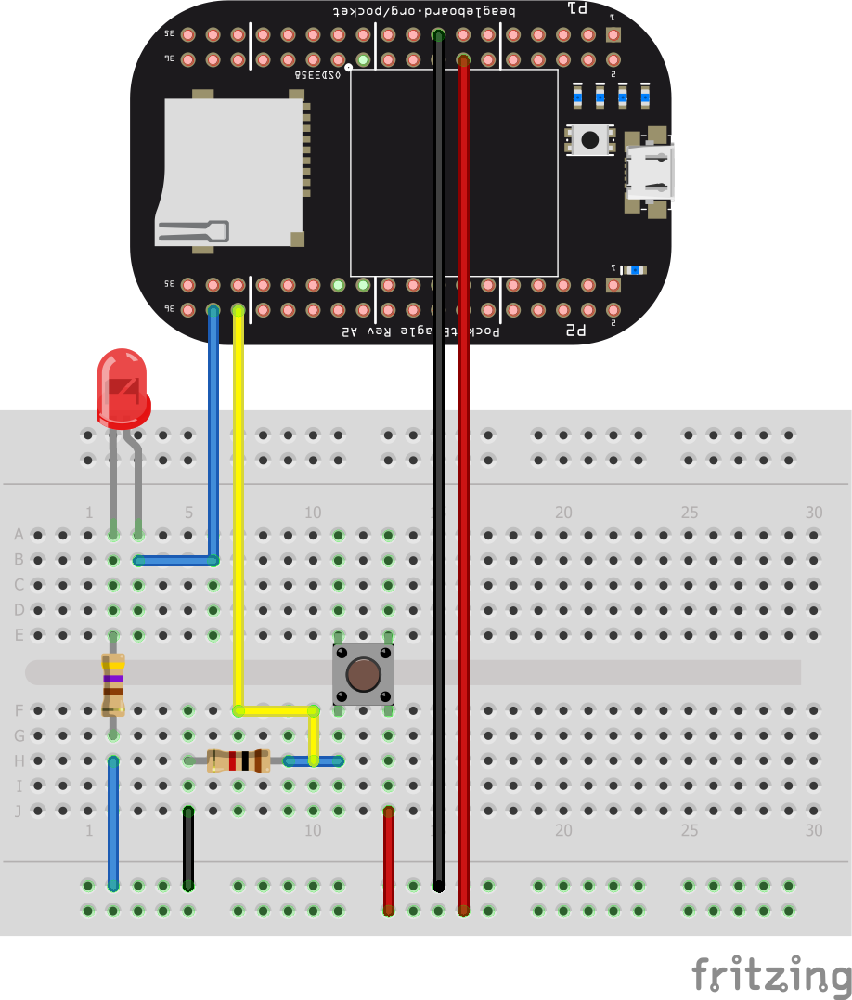

# button-blinking-led
This example is written to demonstrate how to use input and control output based on the input value.

## Wiring the Button and LED

## Firmware
To build the PRU firmware:

	cd blinking-led/pru
	make

## Remoteproc host driver

First setup remoteproc driver by following [../REMOTEPROC.md](../REMOTEPROC.md).

Build and install firmware:

	cd blinking-led/pru
	make
	sudo bash
	cp out/pru-core0.elf /lib/firmware/pru-core0.elf
	echo stop /sys/class/remoteproc/remoteproc1/state
	echo pru-core0.elf > /sys/class/remoteproc/remoteproc1/firmware
	echo start /sys/class/remoteproc/remoteproc1/state

In order to see the blinking led when you press the button you'll need to configure the pin mux:

       
	sudo sh -c "echo 'pruout' > /sys/devices/platform/ocp/ocp:P2_34_pinmux/state"
	sudo sh -c "echo 'pruin' > /sys/devices/platform/ocp/ocp:P2_32_pinmux/state"

or you can also use the following commands  to configure pin mux:

	sudo config-pin P2.34 pruout
	sudo config-pin P2.32 pruin

change the pin numbers as per your usage

## Acknowledgements
 * Beagleboard.org test debian image has been used for running the blinking LED example: http://beagleboard.org/latest-images/

